# Especificação Técnica de Design — Jornada Guiada de Onboarding e Brand DNA

> **Data:** 2026-07-21  
> **Status:** Proposta de Design (Aguardando Aprovação para Transição para Plano)  
> **Baseado no PRD:** `PRD_Onboarding_Jornada_Guiada.md` (Seções 1 a 35)

---

## 1. Visão Geral e Arquitetura

Este documento especifica a arquitetura técnica, modelo de dados e o fluxo de telas para a **Jornada Guiada de Onboarding e Brand DNA** do SocialHub, utilizando a **Abordagem A (Página Dedicada `/onboarding` com Interceptação e Bloqueio no `AppLayout`)**.

### 1.1 Objetivo
Eliminar a entrada em um dashboard vazio e remover a complexidade técnica inicial. O usuário, em seu primeiro acesso para uma marca, é conduzido por uma jornada de 7 etapas simples, onde a inteligência artificial analisa o Instagram conectado e extrai/gera automaticamente a identidade da marca, o Brand DNA e o planejamento inicial de ideias da semana.

### 1.2 Regra de Interceptação e Roteamento (`AppLayout` & `AppShell`)
- **Regra de Entrada (§4):** Quando o usuário acessa qualquer rota autenticada em `app/(app)/*` (como `/dashboard`, `/calendar`, `/strategy`, `/composer`), o sistema verifica o estado de onboarding da marca ativa (`kit.onboarding_status !== 'completed' && !kit.dna_generated_at`).
- **Comportamento de Bloqueio:**
  - Se a marca ativa ainda não completou o onboarding, o usuário é redirecionado para a rota `/onboarding` (ou, alternativamente, o `AppLayout`/`AppShell` renderiza exclusivamente a tela do `GuidedOnboardingWizard` em modo tela cheia, ocultando a navegação lateral e superior até a conclusão).
  - O acesso liberado ao Dashboard e demais módulos ocorre **somente após a conclusão** da etapa 7 da jornada (§34).

### 1.3 Divisão: Básico vs. Avançado
- **Fluxo Básico (Onboarding):** Coleta exclusivamente conexão do Instagram, confirmação de dados básicos inferidos (Nome, Segmento, Tom, Público, Estilo visual sugerido), Objetivo e Frequência. Não solicita logo manual, website, manual em PDF, paleta manual, fontes, nem templates (§3.1).
- **Fluxo Avançado (`Brand Kit → Melhorar precisão da IA`):** Após o onboarding, a página `/brand-kit` centraliza todas as edições manuais e técnicas da identidade da marca (§3.2 e §25). O `BrandKitShell.jsx` atual será limpo do antigo assistente de 6 etapas e passará a oferecer as abas organizadas: **Identidade Visual** e **Informações da Empresa** (§26), além de um painel de melhoria da IA com upload de logo, website, manual e paleta.

---

## 2. Modelo de Dados e Persistência de Estado

A persistência aproveita a tabela `brand_kits` existente no Supabase e suas colunas dedicadas (`onboarding_status`, `onboarding_step`, `onboarding_answers`, além de `dna_generated_at`), bem como as tabelas `brand_dna_versions`, `editorial_plans` e `editorial_plan_items`.

### 2.1 Estados de Onboarding (`onboarding_status`)
- `not_started`: Marca recém-criada ou sem progresso registrado.
- `in_progress`: Usuário iniciou a jornada guiada e avançou pelo menos no passo 1.
- `completed`: Usuário revisou e aprovou o Brand DNA e gerou o planejamento inicial.

### 2.2 Salvamento Automático (`saveOnboardingProgress`) e Retomada (`§28-§30`)
- A cada clique em "Avançar" ou mudança de etapa no wizard, a server action `saveOnboardingProgress({ brandId, step, answers, status: 'in_progress' })` é disparada em segundo plano.
- O campo JSONB `onboarding_answers` acumula todos os dados confirmados, inferidos ou selecionados até o momento.
- Se o usuário fechar a aba e retornar em outra sessão, o wizard carrega `kit.onboarding_step` e `kit.onboarding_answers`, abrindo exatamente no passo onde parou, com os campos preservados.

---

## 3. Especificação do Fluxo de 7 Etapas (`GuidedOnboardingWizard`)

O componente `GuidedOnboardingWizard.jsx` gerencia as 7 etapas em tela cheia, exibindo uma barra de progresso no topo (`Passo X de 7` com porcentagem e status visual - §27) e garantindo a regra de **um passo por tela** com linguagem simples e amigável (§32 e §33).

```dot
digraph GuidedOnboarding {
    rankdir=LR;
    node [shape=box, style=rounded, fontname="Inter"];
    
    Step1 [label="1. Boas-vindas"];
    Step2 [label="2. Conectar Instagram"];
    Step3 [label="3. Análise & Confirmação"];
    Step4 [label="4. Objetivo"];
    Step5 [label="5. Frequência"];
    Step6 [label="6. Brand DNA (Revisão)"];
    Step7 [label="7. Planejamento (Ideias)"];
    
    Step1 -> Step2 -> Step3 -> Step4 -> Step5 -> Step6 -> Step7;
}
```

### Passo 1: Boas-vindas (§6)
- **Conteúdo:** Mensagem calorosa de boas-vindas explicando de forma clara e objetiva que a IA do SocialHub fará toda a configuração inicial analisando o Instagram da empresa em poucos segundos.
- **Ação:** Botão "Começar configuração automática" → avança para Passo 2.

### Passo 2: Conectar Instagram (§7 & §12)
- **Conteúdo:** Botão de conexão OAuth com o Instagram (integrado com `/api/meta/oauth` ou status de `listConnectedPlatforms`).
- **Estados e Tratamento:**
  - *Se já conectado:* Exibe badge verde `@username` e botão "Continuar".
  - *Se falhar ou não conectado:* Exibe botão de nova tentativa preservando dados (§31).
  - *Fallback / Contas Novas (§12):* Se o usuário não possuir Instagram ou for uma conta recém-criada (poucos dados/seguidores), oferece a opção clara "Ou preencha o básico manualmente" solicitando apenas 4 campos simples: Nome da marca, Segmento, Serviço principal e Cidade.

### Passo 3: Análise Automática e Confirmação de Dados (§8 - §17)
- **Análise Automática:** Ao chegar neste passo, se o Instagram estiver conectado, o sistema executa `runInstagramAudit({ brandId })` e extrai dados do perfil e mídia:
  - *Identidade:* Nome (prioridade: Bio > Nome do perfil > Nome do profissional > Username - §13), Bio, Categoria/Segmento inferido (§14), Público e Tom.
  - *Visual (§15-§17):* Paleta de cores dominante (prioridade: Feed > Avatar > Segmento > Fallback), Contraste, Consistência e Estilo visual (sugerindo combinação de características em vez de estilos rígidos).
- **Tela de Progresso:** Feedback visual durante os 3 a 5 segundos de análise ("Analisando bio...", "Extraindo paleta do feed...", "Mapeando tom de voz...").
- **Classificação & Confirmação (§9 - §11):**
  - Exibe um card limpo com os dados extraídos, classificando cada item com badges visuais amigáveis:
    - **Confirmado (`CONFIRMED`)**: Dado exato do Instagram (ex: Nome, Username).
    - **Sugerido pela IA (`INFERRED`)**: Dado derivado (ex: Segmento, Tom, Estilo visual).
    - **Não encontrado (`NOT_FOUND`)**: Campo ausente (solicita preenchimento breve se for obrigatório).
  - Campos obrigatórios para edição/confirmação: `Nome da marca` e `Segmento` (§11).
  - O usuário pode editar rapidamente o que a IA inferiu ou apenas clicar em "Confirmar e Avançar".

### Passo 4: Objetivo (§18)
- **Conteúdo:** Seleção do objetivo estratégico da marca.
- **Regra:** O usuário escolhe **1 objetivo principal** e pode marcar **até 2 objetivos secundários** (ex: Vender, Educar, Captar leads, Fortalecer marca, Gerar autoridade).

### Passo 5: Frequência de Publicação (§19)
- **Conteúdo:** Escolha de quantas vezes por semana a marca deseja publicar.
- **Opções Permitidas:**
  - `3x por semana`
  - `5x por semana`
  - `Diário (7x por semana)`
  - `IA decide (baseado nos melhores horários e segmento)`

### Passo 6: Brand DNA — Geração e Revisão (§20 - §21)
- **Geração Automática:** Dispara em segundo plano a chamada `analyzeBrandDNA({ brandId, ... })` usando as respostas consolidadas e o diagnóstico do Instagram.
- **Apresentação e Revisão (§20 - §21):**
  - O sistema gera e apresenta de forma rica e visual o **Brand DNA** completo:
    - *Público-alvo detalhado*
    - *Tom de voz & Personalidade*
    - *Temas e Pilares de conteúdo recomendados*
    - *Política de CTA (Chamada para ação)*
    - *Estilo visual & Paleta sugerida*
    - *Frequência de publicação escolhida*
  - O usuário revisa o documento gerado e clica no botão "Aprovar Brand DNA e Continuar" (§21).
  - **Efeito no Banco:** Chama `approveDnaVersion` e marca a etapa como aprovada, salvando o DNA no `brand_kits`.

### Passo 7: Planejamento Inicial de Ideias & Finalização (§22 - §24)
- **Geração de Planejamento (§22 - §23):**
  - Dispara automaticamente `generateWeekPlan({ brandId, weekStart: ... })` baseado no Brand DNA aprovado e na frequência escolhida.
  - **Importante:** O plano gera **apenas ideias** (`status: 'idea'`), **não gerando conteúdo definitivo** nem textos longos ou artes prontas nesse momento, mantendo a geração rápida e leve (§22).
  - **Formatos Suportados (§23):** `Post` (imagem única), `Carrossel` e `Story estático`. *Não gerar Reels nem vídeos* na proposta inicial do onboarding.
- **Tela de Conclusão e Redirecionamento (§24):**
  - Exibe resumo de sucesso com os temas sugeridos da semana ("Criamos 5 ideias de posts alinhadas ao seu novo Brand DNA!").
  - Finaliza o onboarding marcando `completeOnboarding({ brandId })` (`status: 'completed'`).
  - Redireciona o usuário para a página de **Aprovações** (`/calendar` ou `/approvals`) ou para o **Dashboard** agora liberado.

---

## 4. Reestruturação do Brand Kit (`/brand-kit`) — Configuração Avançada

Após a conclusão da jornada, se o usuário acessar o Brand Kit (`/brand-kit`), ele não verá o antigo assistente de 6 passos. Ele encontrará a interface de **Configuração Avançada** organizada em duas grandes seções (§26):
1. **Identidade Visual:** Paleta de cores, Estilo visual, Upload de Logo, Fontes e Templates.
2. **Informações da Empresa:** Nome, Segmento, Público, Tom de voz, Storytelling, Emojis, CTAs, Website e Manual da marca.
- Adição da aba clara: **"Melhorar precisão da IA"** (§3.2 e §25), onde o usuário pode fazer upload de manuais em PDF, colar briefings complexos e ajustar regras visuais sem precisar reiniciar o onboarding guiado.
- Botão "Refazer onboarding guiado" (redirecionando para `/onboarding` com reset de status) caso o usuário queira rodar a entrevista do zero.

---

## 5. Estratégia de Verificação e Testes (§35)

Para garantir que o fluxo é robusto, resiliente e atende a todos os critérios de aceitação do PRD (§34 - §35), o plano de verificação contemplará:
1. **Testes de Build & Typecheck:** Verificação de que não há regressões de sintaxe ou quebras nos componentes de layout e wizard.
2. **Testes Unitários / Integração (Vitest):**
   - Validação da extração e priorização de nome (`Bio > Nome do perfil > Profissional > Username`).
   - Validação de normalização de dados (`CONFIRMED`, `INFERRED`, `NOT_FOUND`).
   - Validação da geração de planejamento garantindo apenas status `idea` e formatos permitidos (`post`, `carrossel`, `story`).
3. **Testes Automatizados de Ponta a Ponta (Playwright / E2E):**
   - **Fluxo Feliz Completo:** Marca em `not_started` → Boas-vindas → Conectar IG → Análise → Confirmação → Objetivo → Frequência → Aprovar DNA → Planejamento → Acesso ao Dashboard liberado.
   - **Fluxo de Retomada (§30):** Fechar a aba no Passo 4 (Objetivo) e reabrir a página, confirmando que o wizard abre exatamente no Passo 4 preservando as respostas anteriores.
   - **Fluxo de Conta Nova / Fallback (§12):** Conta sem Instagram ou com poucos dados, preenchimento dos 4 campos manuais (Nome, Segmento, Serviço, Cidade) e geração do DNA.
   - **Fluxo de Falhas e Retentativa (§31):** Simular falha na análise do Instagram ou geração de DNA e verificar que o botão "Tentar novamente" reexecuta sem apagar os dados preenchidos.

---

## 6. Auto-Revisão do Design (Spec Review)
- [x] **Sem placeholders ou TBDs:** Todas as 7 etapas, campos de banco (`brand_kits.onboarding_status/step/answers`), server actions (`saveOnboardingProgress`, `completeOnboarding`, `analyzeBrandDNA`, `approveDnaVersion`, `generateWeekPlan`) e rotas estão explicitamente mapeados.
- [x] **Consistência interna:** A interceptação em `AppLayout`/`AppShell` com redirecionamento/bloqueio para `/onboarding` garante a regra de entrada sem afetar a modularidade do Brand Kit.
- [x] **Alinhamento exato ao PRD:** Cobertura 1-para-1 de todas as seções de 1 a 35, incluindo restrição de formatos (sem Reels), prioridades de nome e paleta, classificação de dados e separação entre básico e avançado.
